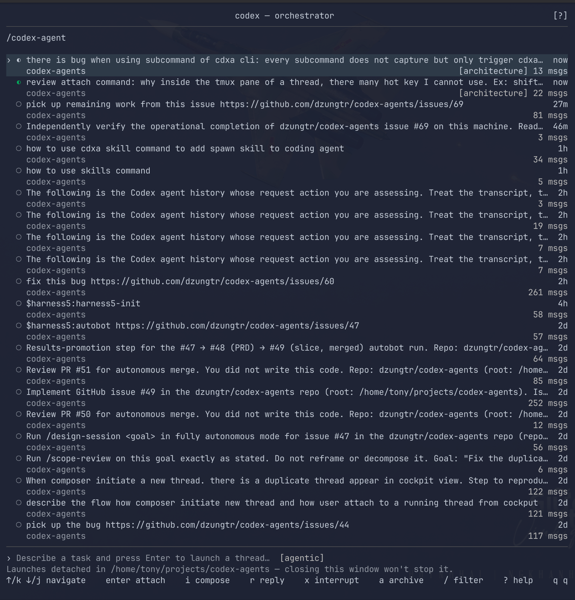

# codex-agents

A terminal cockpit for running several [codex](https://github.com/openai/codex) agents in
parallel. It is *only* a list view — the conversation experience is codex's own TUI,
unmodified.



## Problem

Running several codex agents in parallel means juggling terminal windows by hand: no single
place to see every conversation, no visibility into which agent is blocked waiting for input,
no safe way to launch parallel agents in one checkout, and no way to jump back into an old
session from a global view. `codex resume`'s picker is per-invocation and cwd-scoped.

`codex-agents` derives a list of every codex thread (running, waiting, or finished) straight
from codex's own records, so every conversation shows up — not just ones launched from the
cockpit — with the threads that need your input surfaced at the top.

## Prerequisites

- Go 1.25+
- [tmux](https://github.com/tmux/tmux) installed and on `$PATH` — every cockpit-launched
  thread runs inside a detached tmux session on the **default tmux socket**, so a tmux
  server must already be running outside the terminal's cgroup. Otherwise closing the
  launching terminal kills every spawned thread (see
  [#69](https://github.com/dzungtr/codex-agents/issues/69)). On systemd-logind hosts
  (Fedora, etc.) run tmux as a `systemd --user` service so its `KillMode=process` cgroup
  outlives the originating terminal:

  ```ini
  # ~/.config/systemd/user/tmux-server.service
  [Unit]
  Description=Persistent tmux server for codex-agents threads
  After=default.target

  [Service]
  Type=forking
  ExecStart=/usr/bin/tmux -f /dev/null start-server \; set-option -g exit-empty off
  ExecStop=-/usr/bin/tmux kill-server
  RemainAfterExit=yes
  KillMode=process

  [Install]
  WantedBy=default.target
  ```

  ```sh
  systemctl --user daemon-reload
  systemctl --user enable --now tmux-server.service
  loginctl enable-linger $USER
  ```

  `exit-empty off` is what keeps the server alive after the last session detaches —
  without it the daemon exits as soon as it has no clients, and the next launch starts a
  fresh, terminal-scoped server. `loginctl enable-linger` keeps the user service alive
  across logout. The cockpit never starts a tmux server of its own; whatever server owns
  the default socket when the cockpit launches is what the spawned sessions attach to.
- A working `codex` CLI installation with state under `$CODEX_HOME` (default `~/.codex`)

## Build / run

```sh
go build ./cmd/codex-agents
./codex-agents
```

or, without a separate build step:

```sh
go run ./cmd/codex-agents
```

Run it from the directory you want new threads launched into — the composer starts threads in
that directory (in a per-thread git worktree, if it's a git repo), while the list itself shows
threads across all projects. `$CODEX_HOME` is honored if set, otherwise `~/.codex` is used.

## Keybinds

| Key | Action |
|---|---|
| `↑`/`k`, `↓`/`j` | Move selection |
| `enter` | Attach an alive thread's tmux session, or resume (`codex resume <id>`) and attach a closed one |
| `i` | Focus the composer to launch a new thread (`@` swaps profile, `enter` launches, `esc` cancels) |
| `r` | Quick-reply to the selected alive thread (`enter` sends, `esc` cancels); no-op on closed threads |
| `x` | Interrupt the selected thread's current turn (thread moves to **waiting**) |
| `a` | Archive: kill the tmux session, hide the thread from the list, and offer worktree removal (refuses if there's uncommitted or unpushed work) |
| `/` | Filter the list by title, repo, or branch |
| `?` | Toggle the help overlay |
| `q` / `ctrl+c` | Quit |

Detaching from an attached thread's tmux session (the usual tmux detach chord, e.g. `ctrl+b d`)
returns you to the cockpit with a refreshed list.

Threads move through three statuses, derived rather than self-reported: **working** (tmux
session alive, turn in progress) → **waiting** (tmux session alive, turn ended — needs you) →
**closed** (no tmux session). The list orders waiting → working → closed, most-recent first
within each group — ordering is the attention mechanism; there are no desktop notifications.

## Architecture

See [`docs/adr/0001-codex-agents-cockpit-architecture.md`](docs/adr/0001-codex-agents-cockpit-architecture.md)
for the full architectural contract (stack, read-only sqlite state source, tmux-per-thread
process model, worktree-per-thread launch semantics, status derivation) and measured results.
The original problem/solution/user-story writeup lives in
[PRD issue #1](https://github.com/dzungtr/codex-agents/issues/1).

## Headless delegation (`cdxa`)

A codex thread can delegate work to another codex thread via the headless
`cdxa` binary (a second binary built from the same module, sharing
`internal/`). The architectural contract — three commands (`spawn`,
`output`, `send`), JSON-only stdout, and a frozen exit-code mapping — is
[ADR 0003](docs/adr/0003-cdxa-subthread-cli.md); vocabulary (thread,
subthread, turn) is in [`CONTEXT.md`](CONTEXT.md).

For copy-pasteable parent-thread prompt patterns — poll loops, turn
tracking, send-then-collect refinement, `--wait` blocking, and workspace
selection — see the
[cdxa subthread delegation cookbook](docs/cdxa-subthread-cookbook.md).
